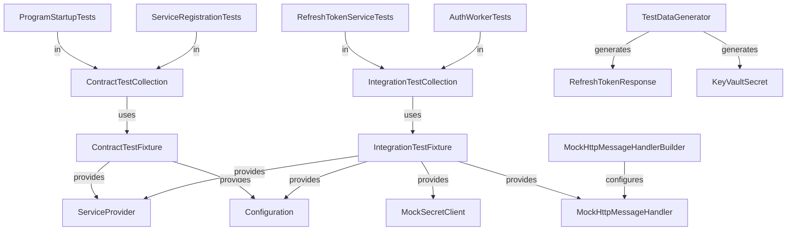

# Data Model: Auth Service Test Coverage and Integration Tests

**Feature**: 008-auth-svc-tests  
**Date**: November 3, 2025  
**Phase**: 1 - Design & Contracts

## Overview

This document defines the test data models, test fixtures, and test infrastructure entities for the Auth Service testing implementation. Since this is a testing feature, the "data model" focuses on test infrastructure components rather than production data entities.

## Test Infrastructure Entities

### 1. ContractTestFixture

**Purpose**: Lightweight test fixture for contract integration tests that verify dependency injection and service registration without initializing external services.

**Properties**:
| Property | Type | Description | Required |
|----------|------|-------------|----------|
| ServiceProvider | IServiceProvider | DI container for resolving services | Yes |
| Configuration | IConfiguration | In-memory configuration with test values | Yes |
| InitializeServices | bool | Always false (no external service setup) | Yes |

**Lifecycle**:
- Created once per test collection (xUnit Collection Fixture)
- Shared across all tests in ContractTestCollection
- Disposed after all contract tests complete

**Responsibilities**:
- Build IHost with in-memory configuration
- Provide ServiceProvider for service resolution tests
- No cleanup required (stateless)

**Validation Rules**:
- Must use MemoryConfigurationSource for all config values
- Must not initialize SecretClient or HttpClient with real endpoints
- Configuration must include all required keys: keyvaulturl, managedidentityclientid, applicationinsightsconnectionstring

---

### 2. IntegrationTestFixture

**Purpose**: Full test fixture for E2E integration tests that provides mocked SecretClient and HttpClient for testing complete workflows.

**Properties**:
| Property | Type | Description | Required |
|----------|------|-------------|----------|
| ServiceProvider | IServiceProvider | DI container with mocked services | Yes |
| MockSecretClient | Mock\<SecretClient\> | Moq mock for Azure Key Vault operations | Yes |
| MockHttpMessageHandler | Mock\<HttpMessageHandler\> | Moq mock for HTTP requests | Yes |
| Configuration | IConfiguration | In-memory configuration with test values | Yes |
| InitializeServices | bool | Always true (setup mocked services) | Yes |

**Lifecycle**:
- Created once per test collection (xUnit Collection Fixture)
- Shared across all tests in IntegrationTestCollection
- Mocks are reset between tests if needed (currently stateless)
- Disposed after all E2E tests complete

**Responsibilities**:
- Build IHost with in-memory configuration
- Setup MockSecretClient with default secret values
- Setup MockHttpMessageHandler with default Fitbit API responses
- Provide ServiceProvider for E2E workflow tests
- Allow per-test mock customization via public Mock properties

**Validation Rules**:
- Must provide default setups for GetSecretAsync (RefreshToken, FitbitCredentials, AccessToken)
- Must provide default setup for Fitbit API POST request (200 OK with valid RefreshTokenResponse)
- Mock setups must be overridable in individual tests for error scenarios

---

### 3. RefreshTokenResponse (Production Model - Test Data)

**Purpose**: Data model representing Fitbit OAuth2 token response (already exists in production code, used as test data).

**Properties**:
| Property | Type | Description | Example Value |
|----------|------|-------------|---------------|
| AccessToken | string | JWT access token | "eyJhbGciOiJIUzI1NiIsInR5cCI6IkpXVCJ9..." |
| RefreshToken | string | Refresh token for obtaining new access tokens | "a1b2c3d4e5f6g7h8i9j0" |
| ExpiresIn | int | Token expiration time in seconds | 28800 |
| Scope | string | OAuth2 scopes granted | "activity heartrate profile" |
| TokenType | string | Token type | "Bearer" |
| UserId | string | Fitbit user ID | "ABC123" |

**Test Data Generation**:
- Use AutoFixture for generating random valid values
- Use fixed values for predictable assertion scenarios
- Example fixed values:
  ```json
  {
    "access_token": "test-access-token-12345",
    "refresh_token": "test-refresh-token-67890",
    "expires_in": 28800,
    "scope": "activity heartrate profile",
    "token_type": "Bearer",
    "user_id": "TEST_USER"
  }
  ```

**Validation Rules** (for test data):
- All string properties must be non-null and non-empty
- ExpiresIn must be positive integer
- TokenType should be "Bearer" for Fitbit tokens
- JSON property names must use snake_case (access_token, not AccessToken) for Fitbit API compatibility

---

### 4. TestDataGenerator (Helper Class)

**Purpose**: Static helper class for generating consistent test data across tests.

**Methods**:

```csharp
public static class TestDataGenerator
{
    /// <summary>
    /// Generates a valid RefreshTokenResponse with default test values
    /// </summary>
    public static RefreshTokenResponse CreateValidRefreshTokenResponse();

    /// <summary>
    /// Generates a RefreshTokenResponse using AutoFixture for random data
    /// </summary>
    public static RefreshTokenResponse CreateRandomRefreshTokenResponse();

    /// <summary>
    /// Generates JSON string representation of RefreshTokenResponse for HTTP mocking
    /// </summary>
    public static string CreateRefreshTokenResponseJson(RefreshTokenResponse response);

    /// <summary>
    /// Generates Azure Key Vault KeyVaultSecret for GetSecretAsync mocking
    /// </summary>
    public static KeyVaultSecret CreateKeyVaultSecret(string name, string value);
}
```

**Responsibilities**:
- Provide consistent test data across all test classes
- Simplify test setup with helper methods
- Ensure test data meets validation requirements

---

### 5. MockHttpMessageHandlerBuilder (Helper Class)

**Purpose**: Fluent builder for configuring HttpMessageHandler mocks to simplify HTTP testing.

**Methods**:

```csharp
public class MockHttpMessageHandlerBuilder
{
    /// <summary>
    /// Sets up successful Fitbit API response with given RefreshTokenResponse
    /// </summary>
    public MockHttpMessageHandlerBuilder WithSuccessResponse(RefreshTokenResponse response);

    /// <summary>
    /// Sets up HTTP error response with given status code
    /// </summary>
    public MockHttpMessageHandlerBuilder WithErrorResponse(HttpStatusCode statusCode);

    /// <summary>
    /// Sets up response with malformed JSON content
    /// </summary>
    public MockHttpMessageHandlerBuilder WithMalformedJson();

    /// <summary>
    /// Sets up response that throws exception (timeout, network error)
    /// </summary>
    public MockHttpMessageHandlerBuilder WithException(Exception exception);

    /// <summary>
    /// Builds the configured Mock<HttpMessageHandler>
    /// </summary>
    public Mock<HttpMessageHandler> Build();
}
```

**Responsibilities**:
- Simplify HttpClient mocking setup in tests
- Provide fluent API for common test scenarios
- Reduce code duplication across test classes

**Example Usage**:
```csharp
var mockHandler = new MockHttpMessageHandlerBuilder()
    .WithSuccessResponse(TestDataGenerator.CreateValidRefreshTokenResponse())
    .Build();

var httpClient = new HttpClient(mockHandler.Object);
```

---

## Test Collection Entities

### 6. ContractTestCollection

**Purpose**: xUnit collection definition for grouping contract tests that share ContractTestFixture.

**Properties**:
| Property | Value | Description |
|----------|-------|-------------|
| Name | "ContractTestCollection" | Collection identifier |
| Fixture Type | ContractTestFixture | Shared fixture type |

**Usage**:
```csharp
[CollectionDefinition("ContractTestCollection")]
public class ContractTestCollection : ICollectionFixture<ContractTestFixture>
{
    // This class has no code, and is never created. Its purpose is simply
    // to be the place to apply [CollectionDefinition] and all the
    // ICollectionFixture<> interfaces.
}
```

**Tests in Collection**:
- ProgramStartupTests
- ServiceRegistrationTests

---

### 7. IntegrationTestCollection

**Purpose**: xUnit collection definition for grouping E2E tests that share IntegrationTestFixture.

**Properties**:
| Property | Value | Description |
|----------|-------|-------------|
| Name | "IntegrationTestCollection" | Collection identifier |
| Fixture Type | IntegrationTestFixture | Shared fixture type |

**Usage**:
```csharp
[CollectionDefinition("IntegrationTestCollection")]
public class IntegrationTestCollection : ICollectionFixture<IntegrationTestFixture>
{
    // This class has no code, and is never created. Its purpose is simply
    // to be the place to apply [CollectionDefinition] and all the
    // ICollectionFixture<> interfaces.
}
```

**Tests in Collection**:
- RefreshTokenServiceTests (E2E)
- AuthWorkerTests (E2E)

---

## Configuration Model

### 8. Test Configuration (appsettings.Test.json)

**Purpose**: In-memory configuration values for test scenarios.

**Required Keys**:
```json
{
  "keyvaulturl": "https://test-keyvault.vault.azure.net/",
  "managedidentityclientid": "00000000-0000-0000-0000-000000000000",
  "applicationinsightsconnectionstring": "InstrumentationKey=00000000-0000-0000-0000-000000000000"
}
```

**Validation Rules**:
- keyvaulturl must be valid URI format
- managedidentityclientid must be valid GUID format
- applicationinsightsconnectionstring can be any non-empty string

**Usage in Fixtures**:
```csharp
var config = new ConfigurationBuilder()
    .AddInMemoryCollection(new Dictionary<string, string>
    {
        { "keyvaulturl", "https://test-keyvault.vault.azure.net/" },
        { "managedidentityclientid", "00000000-0000-0000-0000-000000000000" },
        { "applicationinsightsconnectionstring", "InstrumentationKey=00000000-0000-0000-0000-000000000000" }
    })
    .Build();
```

---

## Relationships



---

## State Transitions

### ContractTestFixture Lifecycle

```
[Created] → [Host Built] → [Tests Execute] → [Disposed]
```

**Created**: Triggered by first test in ContractTestCollection
- Build IHost with in-memory configuration
- Initialize ServiceProvider

**Host Built**: Fixture ready for test use
- Tests can resolve services from ServiceProvider
- Tests verify DI registration and lifetimes

**Tests Execute**: All contract tests run sequentially
- Tests are read-only (no state mutations)
- No cleanup needed between tests

**Disposed**: After all contract tests complete
- Host is disposed
- Resources cleaned up automatically

---

### IntegrationTestFixture Lifecycle

```
[Created] → [Mocks Setup] → [Host Built] → [Tests Execute] → [Disposed]
```

**Created**: Triggered by first test in IntegrationTestCollection
- Create Mock\<SecretClient\>
- Create Mock\<HttpMessageHandler\>

**Mocks Setup**: Default mock behaviors configured
- MockSecretClient.GetSecretAsync returns test secrets
- MockHttpMessageHandler returns successful Fitbit API response

**Host Built**: Fixture ready for test use
- Build IHost with mocked services
- Initialize ServiceProvider

**Tests Execute**: All E2E tests run sequentially
- Tests can customize mock setups for specific scenarios
- Tests execute workflows with mocked dependencies
- No cleanup needed (mocks are stateless)

**Disposed**: After all E2E tests complete
- Mocks disposed
- Host disposed
- Resources cleaned up automatically

---

## Validation Rules Summary

### ContractTestFixture
- ✅ Must use in-memory configuration
- ✅ Must not initialize real SecretClient
- ✅ Must provide all required configuration keys
- ✅ Must be stateless (no cleanup required)

### IntegrationTestFixture
- ✅ Must provide MockSecretClient with default setups
- ✅ Must provide MockHttpMessageHandler with default setups
- ✅ Mocks must be overridable per test
- ✅ Must use in-memory configuration
- ✅ Must be stateless (no cleanup required)

### Test Data (RefreshTokenResponse)
- ✅ All string properties non-null and non-empty
- ✅ ExpiresIn must be positive integer
- ✅ JSON must use snake_case property names for Fitbit API compatibility

### Test Configuration
- ✅ keyvaulturl must be valid URI
- ✅ managedidentityclientid must be valid GUID
- ✅ applicationinsightsconnectionstring must be non-empty

---

## Implementation Notes

1. **No Database**: Auth Service doesn't use Cosmos DB, so no database entities or cleanup logic required
2. **Stateless Mocks**: All mocks are stateless, so no cleanup between tests is needed
3. **Sequential Execution**: Tests within a collection run sequentially to prevent race conditions
4. **Mock Reusability**: Mocks are created once per collection but can be customized per test
5. **Configuration Simplicity**: All config values are in-memory, no external files needed

---

## References

- [Weight Service Integration Tests Data Model](../003-weight-svc-integration-tests/data-model.md) - Pattern reference
- [Activity Service Integration Tests Data Model](../005-activity-svc-tests/data-model.md) - Pattern reference
- [xUnit Collection Fixtures Documentation](https://xunit.net/docs/shared-context#collection-fixture)
- [Moq Documentation](https://github.com/moq/moq4/wiki/Quickstart)
