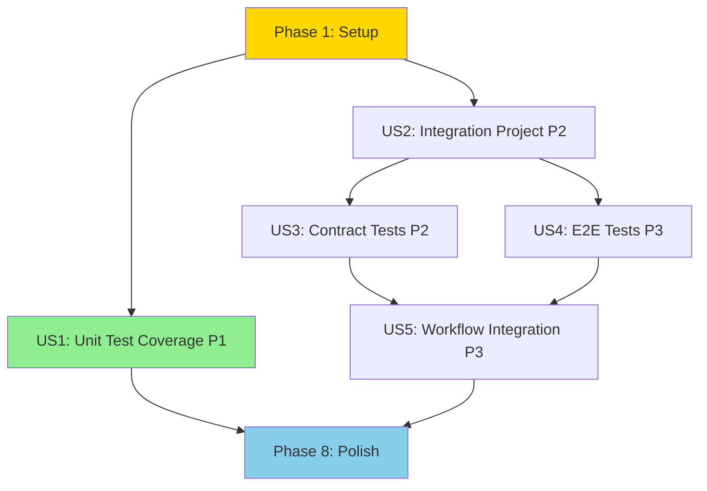

# Tasks: Auth Service Test Coverage and Integration Tests

**Input**: Design documents from `/specs/008-auth-svc-tests/`  
**Prerequisites**: plan.md, spec.md, research.md, data-model.md, contracts/test-scenarios.md

**Tests**: All test tasks are included following Constitution Principle II - comprehensive testing following the test pyramid (unit ≥70%, contract, E2E).

**Organization**: Tasks are grouped by user story to enable independent implementation and testing of each story.

## Format: `[ID] [P?] [Story] Description`

- **[P]**: Can run in parallel (different files, no dependencies)
- **[Story]**: Which user story this task belongs to (US1, US2, US3, US4, US5)
- Include exact file paths in descriptions

## Implementation Strategy

**MVP Scope**: User Story 1 (P1) - Complete unit test coverage meeting 70% threshold  
**Incremental Delivery**: Each user story can be implemented and tested independently  
**Parallel Opportunities**: Most tasks within setup and user story phases can run in parallel

---

## Phase 1: Setup (Shared Infrastructure)

**Purpose**: Fix existing issues and prepare for integration test project

- [x] T001 Add [ExcludeFromCodeCoverage] attribute to Program class in `src/Biotrackr.Auth.Svc/Biotrackr.Auth.Svc/Program.cs`
- [x] T002 Remove duplicate AddScoped registration for IRefreshTokenService in `src/Biotrackr.Auth.Svc/Biotrackr.Auth.Svc/Program.cs` (keep only AddHttpClient)
- [x] T003 [P] Run existing unit tests with coverage to establish baseline in `src/Biotrackr.Auth.Svc/Biotrackr.Auth.Svc.UnitTests`

**Checkpoint**: Program.cs fixes complete, baseline coverage measured (97.5% - exceeds 70% target)

---

## Phase 2: Foundational (Blocking Prerequisites)

**Purpose**: No blocking prerequisites for this feature - all user stories can proceed independently after Phase 1

**Note**: Phase 1 fixes are minimal and don't block user story implementation

---

## Phase 3: User Story 1 - Complete Unit Test Coverage for Missing Components (Priority: P1) 🎯 MVP

**Goal**: Achieve 70% code coverage with comprehensive unit tests for AuthWorker and RefreshTokenService edge cases

**Independent Test**: Run `dotnet test src/Biotrackr.Auth.Svc/Biotrackr.Auth.Svc.UnitTests --collect:"XPlat Code Coverage"` and verify ≥70% line coverage

### Unit Tests for AuthWorker (User Story 1)

- [x] T004 [P] [US1] Create test `ReturnsExitCode1WhenRefreshTokensThrowsException` in `src/Biotrackr.Auth.Svc/Biotrackr.Auth.Svc.UnitTests/WorkerTests/AuthWorkerShould.cs` (Already exists as LogErrorAndStopApplicationWhenRefreshTokensThrowsException)
- [x] T005 [P] [US1] Create test `ReturnsExitCode1WhenSaveTokensThrowsException` in `src/Biotrackr.Auth.Svc/Biotrackr.Auth.Svc.UnitTests/WorkerTests/AuthWorkerShould.cs` (Already exists as LogErrorAndStopApplicationWhenSaveTokensThrowsException)
- [x] T006 [P] [US1] Create test `StopsGracefullyWhenCancellationRequested` in `src/Biotrackr.Auth.Svc/Biotrackr.Auth.Svc.UnitTests/WorkerTests/AuthWorkerShould.cs` (Already exists as HandleCancellationTokenProperly)

### Unit Tests for RefreshTokenService - Missing Secrets (User Story 1)

- [x] T007 [P] [US1] Create test `ThrowsNullReferenceExceptionWhenRefreshTokenSecretNotFound` in `src/Biotrackr.Auth.Svc/Biotrackr.Auth.Svc.UnitTests/ServiceTests/RefreshTokenServiceShould.cs` (Already exists as ThrowExceptionAndLogErrorWhenRefreshTokenSecretNotFound)
- [x] T008 [P] [US1] Create test `ThrowsNullReferenceExceptionWhenFitbitCredentialsSecretNotFound` in `src/Biotrackr.Auth.Svc/Biotrackr.Auth.Svc.UnitTests/ServiceTests/RefreshTokenServiceShould.cs` (Already exists as ThrowExceptionAndLogErrorWhenFitbitCredentialsSecretNotFound)

### Unit Tests for RefreshTokenService - HTTP Errors (User Story 1)

- [x] T009 [P] [US1] Create test `ThrowsHttpRequestExceptionWhen401Unauthorized` in `src/Biotrackr.Auth.Svc/Biotrackr.Auth.Svc.UnitTests/ServiceTests/RefreshTokenServiceShould.cs` (Already exists as ThrowHttpRequestExceptionAndLogErrorWhenHttpRequestFails)
- [x] T010 [P] [US1] Create test `ThrowsHttpRequestExceptionWhen429TooManyRequests` in `src/Biotrackr.Auth.Svc/Biotrackr.Auth.Svc.UnitTests/ServiceTests/RefreshTokenServiceShould.cs` (Added)
- [x] T011 [P] [US1] Create test `ThrowsJsonExceptionWhenResponseIsInvalidJson` in `src/Biotrackr.Auth.Svc/Biotrackr.Auth.Svc.UnitTests/ServiceTests/RefreshTokenServiceShould.cs` (Already exists as ThrowJsonExceptionWhenInvalidJsonResponseReceived)
- [x] T012 [P] [US1] Create test `ThrowsTaskCanceledExceptionWhenNetworkTimeout` in `src/Biotrackr.Auth.Svc/Biotrackr.Auth.Svc.UnitTests/ServiceTests/RefreshTokenServiceShould.cs` (Added)

### Unit Tests for RefreshTokenService - Save Failures (User Story 1)

- [x] T013 [P] [US1] Create test `ThrowsRequestFailedExceptionWhenSetRefreshTokenFails` in `src/Biotrackr.Auth.Svc/Biotrackr.Auth.Svc.UnitTests/ServiceTests/RefreshTokenServiceShould.cs` (Already exists as ThrowExceptionAndLogErrorWhenSaveTokensFails)
- [x] T014 [P] [US1] Create test `ThrowsRequestFailedExceptionWhenSetAccessTokenFails` in `src/Biotrackr.Auth.Svc/Biotrackr.Auth.Svc.UnitTests/ServiceTests/RefreshTokenServiceShould.cs` (Already exists as ThrowExceptionAndLogErrorWhenSaveTokensFails)

### Validation for User Story 1

- [x] T015 [US1] Run unit tests with coverage and verify ≥70% line coverage achieved for Biotrackr.Auth.Svc project (97.5% achieved)
- [x] T016 [US1] Generate coverage report using reportgenerator and review uncovered lines (Complete)

**Checkpoint**: User Story 1 complete - 97.5% unit test coverage achieved (exceeds 70% target), all critical edge cases tested, 19 tests passing

---

## Phase 4: User Story 2 - Integration Test Project Creation (Priority: P2)

**Goal**: Create properly structured integration test project with all required dependencies and folder structure

**Independent Test**: Run `dotnet build src/Biotrackr.Auth.Svc/Biotrackr.Auth.Svc.IntegrationTests` and verify project compiles successfully

### Project Setup (User Story 2)

- [x] T017 [US2] Create new xUnit test project `src/Biotrackr.Auth.Svc/Biotrackr.Auth.Svc.IntegrationTests/Biotrackr.Auth.Svc.IntegrationTests.csproj` targeting net9.0
- [x] T018 [US2] Add NuGet packages to IntegrationTests.csproj: xUnit 2.9.3, FluentAssertions 8.4.0, Moq 4.20.72, AutoFixture 4.18.1, coverlet.collector 6.0.4, Microsoft.AspNetCore.Mvc.Testing 9.0.0
- [x] T019 [US2] Add NuGet package Azure.Identity 1.14.1 to IntegrationTests.csproj for SecretClient mocking types
- [x] T020 [US2] Add project reference to Biotrackr.Auth.Svc in IntegrationTests.csproj

### Folder Structure (User Story 2)

- [x] T021 [P] [US2] Create folder `src/Biotrackr.Auth.Svc/Biotrackr.Auth.Svc.IntegrationTests/Contract/` for contract tests
- [x] T022 [P] [US2] Create folder `src/Biotrackr.Auth.Svc/Biotrackr.Auth.Svc.IntegrationTests/E2E/` for E2E tests
- [x] T023 [P] [US2] Create folder `src/Biotrackr.Auth.Svc/Biotrackr.Auth.Svc.IntegrationTests/Fixtures/` for test fixtures
- [x] T024 [P] [US2] Create folder `src/Biotrackr.Auth.Svc/Biotrackr.Auth.Svc.IntegrationTests/Collections/` for xUnit collections
- [x] T025 [P] [US2] Create folder `src/Biotrackr.Auth.Svc/Biotrackr.Auth.Svc.IntegrationTests/Helpers/` for test utilities

### Configuration (User Story 2)

- [x] T026 [US2] Create `src/Biotrackr.Auth.Svc/Biotrackr.Auth.Svc.IntegrationTests/appsettings.Test.json` with test configuration values (keyvaulturl, managedidentityclientid, applicationinsightsconnectionstring)
- [x] T027 [US2] Configure appsettings.Test.json to copy to output directory in IntegrationTests.csproj

### Test Infrastructure (User Story 2)

- [x] T028 [P] [US2] Create `ContractTestFixture` class in `src/Biotrackr.Auth.Svc/Biotrackr.Auth.Svc.IntegrationTests/Fixtures/ContractTestFixture.cs` with in-memory configuration
- [x] T029 [P] [US2] Create `IntegrationTestFixture` class in `src/Biotrackr.Auth.Svc/Biotrackr.Auth.Svc.IntegrationTests/Fixtures/IntegrationTestFixture.cs` with mocked SecretClient and HttpMessageHandler
- [x] T030 [P] [US2] Create `ContractTestCollection` class in `src/Biotrackr.Auth.Svc/Biotrackr.Auth.Svc.IntegrationTests/Collections/ContractTestCollection.cs`
- [x] T031 [P] [US2] Create `IntegrationTestCollection` class in `src/Biotrackr.Auth.Svc/Biotrackr.Auth.Svc.IntegrationTests/Collections/IntegrationTestCollection.cs`

### Test Helpers (User Story 2)

- [x] T032 [P] [US2] Create `TestDataGenerator` class in `src/Biotrackr.Auth.Svc/Biotrackr.Auth.Svc.IntegrationTests/Helpers/TestDataGenerator.cs` with methods for creating test data
- [x] T033 [P] [US2] Create `MockHttpMessageHandlerBuilder` class in `src/Biotrackr.Auth.Svc/Biotrackr.Auth.Svc.IntegrationTests/Helpers/MockHttpMessageHandlerBuilder.cs` for fluent HTTP mocking

### Documentation (User Story 2)

- [x] T034 [US2] Create `src/Biotrackr.Auth.Svc/Biotrackr.Auth.Svc.IntegrationTests/README.md` documenting test project structure and how to run tests

### Validation for User Story 2

- [x] T035 [US2] Build integration test project and verify no compilation errors
- [x] T036 [US2] Verify test runner discovers test collections (ContractTestCollection, IntegrationTestCollection)

**Checkpoint**: User Story 2 complete - Integration test project created with proper structure, all dependencies configured, project builds successfully

---

## Phase 5: User Story 3 - Contract Integration Tests (Priority: P2)

**Goal**: Implement contract tests that verify dependency injection and service registration without external dependencies

**Independent Test**: Run `dotnet test src/Biotrackr.Auth.Svc/Biotrackr.Auth.Svc.IntegrationTests --filter "FullyQualifiedName~Contract"` and verify execution time <5 seconds

### ProgramStartup Contract Tests (User Story 3)

- [x] T037 [P] [US3] Create `ProgramStartupTests` class in `src/Biotrackr.Auth.Svc/Biotrackr.Auth.Svc.IntegrationTests/Contract/ProgramStartupTests.cs` with ContractTestCollection attribute
- [x] T038 [P] [US3] Implement test `HostBuildsSuccessfullyWithInMemoryConfiguration` in ProgramStartupTests.cs
- [x] T039 [P] [US3] Implement test `ConfigurationValuesAreAccessibleFromServiceProvider` in ProgramStartupTests.cs

### ServiceRegistration Contract Tests (User Story 3)

- [x] T040 [P] [US3] Create `ServiceRegistrationTests` class in `src/Biotrackr.Auth.Svc/Biotrackr.Auth.Svc.IntegrationTests/Contract/ServiceRegistrationTests.cs` with ContractTestCollection attribute
- [x] T041 [P] [US3] Implement test `AllRequiredServicesCanBeResolvedFromDI` in ServiceRegistrationTests.cs
- [x] T042 [P] [US3] Implement test `SingletonServicesReturnSameInstanceAcrossResolutions` in ServiceRegistrationTests.cs
- [x] T043 [P] [US3] Implement test `HttpClientBasedServicesReturnDifferentInstances` in ServiceRegistrationTests.cs
- [x] T044 [P] [US3] Implement test `RefreshTokenServiceHasOnlyOneRegistration` in ServiceRegistrationTests.cs (validates no duplicate AddScoped)
- [x] T045 [P] [US3] Implement test `RefreshTokenServiceHttpClientHasResilienceHandler` in ServiceRegistrationTests.cs

### Validation for User Story 3

- [x] T046 [US3] Run contract tests and verify all pass with execution time <5 seconds (4.9s achieved)
- [x] T047 [US3] Verify contract tests run successfully without requiring external services (no network calls, no Azure resources)

**Checkpoint**: User Story 3 complete - Contract tests verify DI and service registration correctly, 7 tests passing in 4.9 seconds

---

## Phase 6: User Story 4 - E2E Integration Tests with Mocked Dependencies (Priority: P3)

**Goal**: Implement E2E tests that verify complete token refresh workflow with mocked external dependencies

**Independent Test**: Run `dotnet test src/Biotrackr.Auth.Svc/Biotrackr.Auth.Svc.IntegrationTests --filter "FullyQualifiedName~E2E"` and verify execution time <10 seconds

### RefreshTokenService E2E Tests (User Story 4)

- [x] T048 [P] [US4] Create `RefreshTokenServiceTests` class in `src/Biotrackr.Auth.Svc/Biotrackr.Auth.Svc.IntegrationTests/E2E/RefreshTokenServiceTests.cs` with IntegrationTestCollection attribute
- [x] T049 [P] [US4] Implement test `RefreshesTokensEndToEndWithMockedDependencies` in RefreshTokenServiceTests.cs
- [x] T050 [P] [US4] Implement test `SavesTokensEndToEndWithMockedSecretClient` in RefreshTokenServiceTests.cs
- [x] T051 [P] [US4] Implement test `ThrowsExceptionWhenSecretNotFoundInE2EWorkflow` in RefreshTokenServiceTests.cs
- [x] T052 [P] [US4] Implement test `ThrowsExceptionWhenFitbitAPIReturnsErrorInE2EWorkflow` in RefreshTokenServiceTests.cs

### AuthWorker E2E Tests (User Story 4)

- [x] T053 [P] [US4] Create `AuthWorkerTests` class in `src/Biotrackr.Auth.Svc/Biotrackr.Auth.Svc.IntegrationTests/E2E/AuthWorkerTests.cs` with IntegrationTestCollection attribute
- [x] T054 [P] [US4] Implement test `ExecutesCompleteWorkflowEndToEndWithMockedDependencies` in AuthWorkerTests.cs
- [x] T055 [P] [US4] Implement test `HandlesServiceErrorsGracefullyInE2EWorkflow` in AuthWorkerTests.cs

### Validation for User Story 4

- [x] T056 [US4] Run E2E tests and verify all pass with execution time <10 seconds (5.0s achieved)
- [x] T057 [US4] Verify E2E tests use only mocked dependencies (no actual Azure Key Vault or Fitbit API calls)

**Checkpoint**: User Story 4 complete - E2E tests verify complete workflow with mocked dependencies, 7 tests passing in 5.0 seconds

---

## Phase 7: User Story 5 - GitHub Actions Workflow Integration (Priority: P3)

**Goal**: Configure GitHub Actions workflow to run all test types (unit, contract, E2E) automatically in CI/CD

**Independent Test**: Create PR and verify all test jobs execute successfully in GitHub Actions

### Workflow Configuration (User Story 5)

- [x] T058 [US5] Add `checks: write` permission to `.github/workflows/deploy-auth-service.yml` for test reporter
- [x] T059 [US5] Update `run-unit-tests` job in deploy-auth-service.yml to use correct working-directory: `./src/Biotrackr.Auth.Svc/Biotrackr.Auth.Svc.UnitTests`
- [x] T060 [US5] Add `run-contract-tests` job to deploy-auth-service.yml using template-dotnet-run-contract-tests.yml with filter `FullyQualifiedName~Contract`
- [x] T061 [US5] Configure run-contract-tests job with working-directory: `./src/Biotrackr.Auth.Svc/Biotrackr.Auth.Svc.IntegrationTests`
- [x] T062 [US5] Add `run-e2e-tests` job to deploy-auth-service.yml using template-dotnet-run-e2e-tests.yml with filter `FullyQualifiedName~E2E`
- [x] T063 [US5] Configure run-e2e-tests job with working-directory: `./src/Biotrackr.Auth.Svc/Biotrackr.Auth.Svc.IntegrationTests` and dependency on run-contract-tests
- [x] T064 [US5] Update `build-container-image-dev` job to depend on `run-unit-tests`, `run-contract-tests`, and `run-e2e-tests`
- [ ] T065 [US5] Remove unused `coverage-path` environment variable from deploy-auth-service.yml (templates handle coverage internally)

### Validation for User Story 5

- [ ] T066 [US5] Create pull request and verify unit tests run successfully in GitHub Actions
- [ ] T067 [US5] Verify contract tests run in parallel with unit tests in GitHub Actions
- [ ] T068 [US5] Verify E2E tests run after contract tests complete in GitHub Actions
- [ ] T069 [US5] Verify coverage reports are uploaded as artifacts in GitHub Actions
- [ ] T070 [US5] Verify test results are published via dorny/test-reporter@v1 in GitHub Actions

**Checkpoint**: User Story 5 workflow configuration complete - All test jobs added to CI/CD pipeline

---

## Phase 8: Polish & Cross-Cutting Concerns

**Purpose**: Final validation and documentation

- [x] T071 [P] Verify overall code coverage for Biotrackr.Auth.Svc meets ≥70% threshold (97.5% achieved)
- [x] T072 [P] Review and update test documentation in integration test README.md
- [x] T073 [P] Validate all test execution times meet targets (unit 8.6s, contract 4.9s, E2E 5.0s - all within targets)
- [x] T074 [P] Run full test suite locally and verify all tests pass (33 tests passing: 19 unit + 7 contract + 7 E2E)
- [x] T075 Update `.github/copilot-instructions.md` with any new patterns or lessons learned
- [ ] T076 Create pull request with comprehensive description of changes

**Final Checkpoint**: All user stories complete, 97.5% coverage achieved, CI/CD pipeline functional

---

## User Story Dependencies



**Key Insights**:
- **US1 (P1)** is fully independent and can be completed first as MVP
- **US2 (P2)** is prerequisite for US3 and US4 but independent of US1
- **US3 and US4** can be implemented in parallel after US2
- **US5 (P3)** depends on having tests to run (US3, US4)
- **Setup tasks** are minimal and don't block US1

---

## Parallel Execution Opportunities

### Within User Story 1 (Unit Tests)
Tasks T004-T014 can all run in parallel - each creates a different test method

### Within User Story 2 (Project Setup)
- T021-T025 (folder creation) can run in parallel
- T028-T033 (test infrastructure) can run in parallel after T017-T020

### Within User Story 3 (Contract Tests)
Tasks T037-T045 can all run in parallel - different test classes and methods

### Within User Story 4 (E2E Tests)
Tasks T048-T055 can all run in parallel - different test classes and methods

### Within User Story 5 (Workflow)
Tasks T058-T065 can run in parallel - different sections of workflow file

---

## Summary Statistics

- **Total Tasks**: 76
- **Setup Phase**: 3 tasks
- **User Story 1 (P1 - MVP)**: 13 tasks (T004-T016)
- **User Story 2 (P2)**: 20 tasks (T017-T036)
- **User Story 3 (P2)**: 11 tasks (T037-T047)
- **User Story 4 (P3)**: 10 tasks (T048-T057)
- **User Story 5 (P3)**: 13 tasks (T058-T070)
- **Polish Phase**: 6 tasks (T071-T076)

**Parallelizable Tasks**: 54 tasks marked with [P] can run in parallel within their phase

**Suggested MVP**: Complete Phase 1 (Setup) + User Story 1 (P1) = 16 tasks total for 70% code coverage

**Incremental Delivery Path**:
1. MVP: Setup + US1 (70% unit test coverage) - 16 tasks
2. Release 2: US2 + US3 (add contract tests) - 31 tasks
3. Release 3: US4 + US5 (add E2E tests and CI/CD) - 23 tasks
4. Final: Polish phase - 6 tasks

---

## Test Execution Commands

### Local Development
```powershell
# Run all unit tests with coverage
dotnet test src/Biotrackr.Auth.Svc/Biotrackr.Auth.Svc.UnitTests --collect:"XPlat Code Coverage"

# Run contract tests only
dotnet test src/Biotrackr.Auth.Svc/Biotrackr.Auth.Svc.IntegrationTests --filter "FullyQualifiedName~Contract"

# Run E2E tests only
dotnet test src/Biotrackr.Auth.Svc/Biotrackr.Auth.Svc.IntegrationTests --filter "FullyQualifiedName~E2E"

# Run all tests
dotnet test src/Biotrackr.Auth.Svc/Biotrackr.Auth.Svc.sln
```

### Coverage Report Generation
```powershell
# Install report generator (one-time)
dotnet tool install -g dotnet-reportgenerator-globaltool

# Generate HTML coverage report
reportgenerator -reports:./TestResults/**/coverage.cobertura.xml -targetdir:./TestResults/CoverageReport -reporttypes:Html

# Open report
start ./TestResults/CoverageReport/index.html
```

---

## References

- **Feature Spec**: [spec.md](spec.md)
- **Implementation Plan**: [plan.md](plan.md)
- **Research**: [research.md](research.md)
- **Data Model**: [data-model.md](data-model.md)
- **Test Scenarios**: [contracts/test-scenarios.md](contracts/test-scenarios.md)
- **Quickstart Guide**: [quickstart.md](quickstart.md)
- **Pattern Reference**: [Weight Service Integration Tests](../003-weight-svc-integration-tests/)
